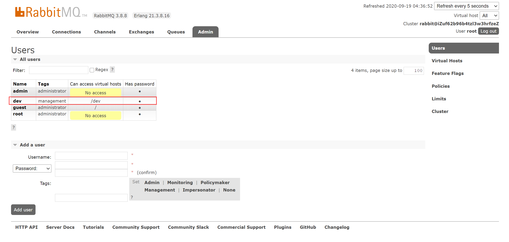

##### RabbitMQ
AMQP，即Advanced Message Queuing Protocol，一个提供统一消息服务的应用层标准高级消息队列协议，是应用层协议的一个开放标准，为面向消息的中间件设计。基于此协议的客户端与消息中间件可传递消息，并不受客户端/中间件不同产品，不同的开发语言等条件的限制。RabbitMQ为AMQP协议消息中间件。
JMS即Java消息服务（Java Message Service）应用程序接口，是一个Java平台中关于面向消息中间件（MOM）的API，用于在两个应用程序之间，或分布式系统中发送消息，进行异步通信。Java消息服务是一个与具体平台无关的API，绝大多数MOM提供商都对JMS提供支持。

RabbitMQ 提供了 6 中工作模式：简单模式、工作队列模式、发布/订阅模式、路由模式、主题模式 和 RPC 模式,其中简单模式、工作队列模式只涉及生产者、队列、消费者；而发布/订阅、路由与主题模式需要使用Exchange绑定队列实现。

##### 下载安装（CentOS 7）
```
#安装包锁定工具防止不必要的升级
yum install yum-plugin-versionlock
# 锁定某个包
yum versionlock gcc-*
```
导入签名密钥
rpm --import https://github.com/rabbitmq/signing-keys/releases/download/2.0/rabbitmq-release-signing-key.asc

编辑`/etc/yum.repos.d/rabbitmq_erlang.repo`，下载21.x erlang版本，其他系统（centos 8）参考https://github.com/rabbitmq/erlang-rpm
``
[rabbitmq-erlang]
name=rabbitmq-erlang
baseurl=https://dl.bintray.com/rabbitmq-erlang/rpm/erlang/21/el/6
gpgcheck=1
gpgkey=https://dl.bintray.com/rabbitmq/Keys/rabbitmq-release-signing-key.asc
repo_gpgcheck=0
enabled=1
``
```
#安装erlang
yum install erlang
#查看安装版本
erl -version
#
```
编辑文件`/etc/yum.repos.d/Rabbitmq.repo`,其他系统（centos 8）参考https://www.rabbitmq.com/install-rpm.html#package-cloud
```
[bintray-rabbitmq-server]
name=bintray-rabbitmq-rpm
baseurl=https://dl.bintray.com/rabbitmq/rpm/rabbitmq-server/v3.8.x/el/7/
gpgcheck=0
repo_gpgcheck=0
enabled=1
```
执行yum install rabbitmq-server
版本对照


```
#关闭防火墙
systemctl start firewalld
#启动Mq
systemctl start rabbitmq-server
#查看状态
systemctl status rabbitmq-server
#开放15672端口
firewall-cmd --zone=public --add-port=15672/tcp --permanent #开放指定端口 
#查看插件
rabbitmq-plugins list
#启用管理界面
rabbitmq-plugins enable rabbitmq_management #管理界面相关资料https://www.rabbitmq.com/management.html
rabbitmq-plugins enable rabbitmq_tracing #启用日志插件

```


```
#新增远程登录用户
rabbitmqctl add_user root 123456
rabbitmqctl set_user_tags root administrator
```


下载配置文件
https://github.com/rabbitmq/rabbitmq-server/blob/master/docs/rabbitmq.conf.example
查看配置文件参数https://www.rabbitmq.com/configure.html#config-file

##### 管理界面

###### 新增用户

相关详细操作点击用户名称


用户标签（权限）

| 标签 |	能力 |
|----|----|
|（NONE）|	无法访问管理插件 |
| management |	用户可以通过消息传递协议执行的任何操作以及：列出可以通过AMQP登录的虚拟主机、查看它们虚拟主机中的所有队列，交换和绑定、查看和关闭自己的渠道和联系、查看涵盖其所有虚拟主机的“全局”统计信息，包括其中其他用户的活动 |
| policymaker |	一切“management”都可以加上：查看，创建和删除可通过AMQP登录到的虚拟主机的策略和参数 |
| monitoring |	一切“management”都可以加上：列出所有虚拟主机，包括它们无法使用消息传递协议访问的虚拟主机、查看其他用户的联系和渠道、查看节点级别的数据，例如内存使用情况和集群、查看所有虚拟主机的真实全局统计信息 |
| administrator |	“policymaker”和“monitoring”的一切都可以加上：创建和删除虚拟主机、查看，创建和删除用户、查看，创建和删除权限、关闭其他用户的连接 |

###### 虚拟主机


##### RabbitMQ使用
资料<a href="https://www.rabbitmq.com/getstarted.html">https://www.rabbitmq.com/getstarted.html</a>
相关依赖<a href="https://www.rabbitmq.com/java-client.html">https://www.rabbitmq.com/java-client.html</a>
添加一个dev用户

添加一个dev虚拟主机


`pom.xml`
```
<?xml version="1.0" encoding="UTF-8"?>
<project xmlns="http://maven.apache.org/POM/4.0.0"
         xmlns:xsi="http://www.w3.org/2001/XMLSchema-instance"
         xsi:schemaLocation="http://maven.apache.org/POM/4.0.0 http://maven.apache.org/xsd/maven-4.0.0.xsd">
    <modelVersion>4.0.0</modelVersion>

    <groupId>com.jty</groupId>
    <artifactId>rabbitmqDemo</artifactId>
    <version>1.0-SNAPSHOT</version>

    <properties>
        <project.build.sourceEncoding>UTF-8</project.build.sourceEncoding>
        <maven.compiler.encoding>UTF-8</maven.compiler.encoding>
        <maven.compiler.source>11</maven.compiler.source>
        <maven.compiler.target>11</maven.compiler.target>
    </properties>
    <dependencies>
        <dependency>
            <groupId>com.rabbitmq</groupId>
            <artifactId>amqp-client</artifactId>
            <version>5.9.0</version>
        </dependency>
    </dependencies>
</project>
```
###### Simplest简单模式
`Simplest.java`
```
/**
 * @author :jty
 * @date :20-9-19
 * Simplest模式：简单一对一案例
 * 如果队列中有消息,就消费掉,消息被拿走后,自动从队列中删除(隐患 消息可能没有被消费者正确处理,已经从队列中消失了,造成消息的丢失)
 */
public class Simplest {
    private final static String QUEUE_NAME = "hello";
    public static void main(String[] argv) throws Exception {
        ConnectionFactory factory = new ConnectionFactory();
        //RabbitMQ服务器地址
        factory.setHost("106.xx.xxx.229");
        factory.setVirtualHost("/dev");
        factory.setUsername("dev");
        factory.setPassword("123456");
        try (Connection connection = factory.newConnection();
             Channel channel = connection.createChannel()) {
            /**
             * durable
             * queue 队列名称
             * durable 如果为true则声明一个持久队列，则（该队列将在服务器重启后保留下来）
             * exclusive 如果为true则声明一个独占队列（仅限此连接）
             * autoDelete 如果为true则声明一个自动删除队列（服务器将在不再使用它时将其删除）
             * arguments 队列的其他属性（构造参数）
             * */
            channel.queueDeclare(QUEUE_NAME, false, false, false, null);
            String message = "Hello World!";
            channel.basicPublish("", QUEUE_NAME, null, message.getBytes());
            System.out.println(" [x] Sent '" + message + "'");
        }
    }
}

```


消息被消费

关闭消费者后重新推送消息


###### WorkQueues工作队列
生产者`WorkQueues.java`
```
/**
 * @author :jty
 * @date :20-9-19
 * 工作队列（竞争的消费者模式）
 * 一个生产者，多个消费者，每个消费者获取到的消息唯一，多个消费者只有一个队列
 * channel.basicQos(0);prefetchCount=0或没定义时以轮询方式推送消息，prefetchCount>0时共同争抢当前的消息队列内容,谁先拿到谁负责消费消息
 * 任务分配系统不需知道哪一个任务执行系统在空闲,直接将任务扔到消息队列中,空闲的系统自动争抢
 */
public class WorkQueues {
    private final static String QUEUE_NAME = "workQueues";

    public static void main(String[] argv) throws Exception {
        ConnectionFactory factory = new ConnectionFactory();
        //RabbitMQ服务器地址
        factory.setHost("106.14.146.229");
        factory.setVirtualHost("/dev");
        factory.setUsername("dev");
        factory.setPassword("123456");
        try (Connection connection = factory.newConnection();
             Channel channel = connection.createChannel()) {
            /**
             * queue 队列名称
             * durable 如果为true则声明一个持久队列，则（该队列将在服务器重启后保留下来）
             * exclusive 如果为true则声明一个独占队列（仅限此连接）
             * autoDelete 如果为true则声明一个自动删除队列（服务器将在不再使用它时将其删除）
             * arguments 队列的其他属性（构造参数）
             * */
            //消息持久化 MessageProperties.PERSISTENT_TEXT_PLAIN
            channel.queueDeclare(QUEUE_NAME, true, false, false, null);
            for (int i = 0; i < 20; i++) {
                String message = "m" + i;

                if (i == 10) {  
                    message = "m." + i;
                }
                channel.basicPublish("", QUEUE_NAME,
                        MessageProperties.PERSISTENT_TEXT_PLAIN,
                        message.getBytes("UTF-8"));
                System.out.println(" [x] Sent '" + message + "'");
            }
        }
    }
}
```
消费者`Receive20.java`
```
public class Receive20 {
    private final static String QUEUE_NAME2 = "workQueues";

    public static void main(String[] argv) throws Exception {

        ConnectionFactory factory = new ConnectionFactory();
        factory.setHost("106.xx.xxx.229");
        factory.setVirtualHost("/dev");
        factory.setUsername("dev");
        factory.setPassword("123456");

        final Connection connection = factory.newConnection();
        final Channel channel = connection.createChannel();

        channel.queueDeclare(QUEUE_NAME2, true, false, false, null);
        System.out.println(" [*] Waiting for messages. To exit press CTRL+C");

        /**
         *
         * prefetchSize  服务器将交付的最大内容量（以八位字节为单位），如果不受限制，则为0
         * prefetchCount 服务器将传递的最大邮件数，如果没有限制则为0
         * global        如果设置应应用于整个渠道而不是每个消费者，则为true
         * */
        channel.basicQos(0);

        DeliverCallback deliverCallback02 = (consumerTag, delivery) -> {

            String message = new String(delivery.getBody(), "UTF-8");

            System.out.println(" [x] Received '" + message + "'");
            try {
                doWork(message);
            } catch (Exception e) {
                    channel.basicNack(delivery.getEnvelope().getDeliveryTag(),false,false);
            } finally {
                System.out.println(" [x] Done");
                //手动确认消息 multiple=false,不批量处理
                channel.basicAck(delivery.getEnvelope().getDeliveryTag(), false);
            }
        };
        /** autoAck=true 手动确认，此时channel.basicQos(0)生效 */
        channel.basicConsume(QUEUE_NAME2, false, deliverCallback02, consumerTag -> {
        });
    }

    private static void doWork(String task) throws InterruptedException {
        if(task.contains(".")) {
           //针对m.10休眠1秒
           // Thread.sleep(1000);
        }
    }
}
```
消费者`Receive21.java`同 `Receive20.java`


 消费者`Receive21.java` =》 channel.basicQos(1);在消费者2处理的这段时间消息被消费者1消费


消费者`Receive2.java` `Receive21.java`=》  channel.basicQos(1);
改造doWork方法
```
 private static void doWork(String task) throws InterruptedException {
        if(task.contains(".")) {
            //针对m.10休眠10秒
            Thread.sleep(10000);
        }else {
            //否则1秒
            Thread.sleep(1000);
        }
    }
```
在处理m.10的消息的同时另一个消费者将其余消息消费掉


###### Publish/Subscribe发布订阅模式
生产者`PublishAndSubscribe.java`
```
/**
 * @author :jty
 * @date :20-9-20
 * 发布订阅模式
 * 一次向许多消费者发送消息，每个消费者获取相同的消息
 * 生产者扔给交换机消息，交换机根据自身的类型(fanout)将会把所有消息复制同步到所有与其绑定的队列，每个队列可以有一个消费者
 */
public class PublishAndSubscribe {
    private static final String EXCHANGE_NAME = "logs";

    public static void main(String[] argv) throws Exception {
        ConnectionFactory factory = new ConnectionFactory();
        //RabbitMQ服务器地址
        factory.setHost("106.xx.xxx.229");
        factory.setVirtualHost("/dev");
        factory.setUsername("dev");
        factory.setPassword("123456");
        try (Connection connection = factory.newConnection();
             Channel channel = connection.createChannel()) {
            channel.exchangeDeclare(EXCHANGE_NAME, "fanout");

            for (int i = 0; i < 20; i++) {
                String message = "m" + i;

                if (i == 10) {
                    message = "m." + i;
                }
                channel.basicPublish(EXCHANGE_NAME, "", null, message.getBytes("UTF-8"));
                System.out.println(" [x] Sent '" + message + "'");
            }

        }
    }
}
```
消费者`Receive30.java`
```
public class Receive30 {
    private static final String EXCHANGE_NAME = "logs";

    public static void main(String[] argv) throws Exception {

        ConnectionFactory factory = new ConnectionFactory();
        factory.setHost("106.xx.xxx.229");
        factory.setVirtualHost("/dev");
        factory.setUsername("dev");
        factory.setPassword("123456");
        Connection connection = factory.newConnection();
        Channel channel = connection.createChannel();

        //交换机类型为fanout,定义一个队列（系统自命名）绑定该交换机，队列将获取交换机内所有的消息
        channel.exchangeDeclare(EXCHANGE_NAME, "fanout");
        String queueName = channel.queueDeclare().getQueue();
        channel.queueBind(queueName, EXCHANGE_NAME, "");

        System.out.println(" [*] Waiting for messages. To exit press CTRL+C");

        DeliverCallback deliverCallback = (consumerTag, delivery) -> {
            String message = new String(delivery.getBody(), "UTF-8");
            System.out.println(" [x] Received '" + message + "'");
        };
        channel.basicConsume(queueName, true, deliverCallback, consumerTag -> {
        });
    }
}
```
消费者`Receive31.java`同 `Receive30.java`


###### Routing路由模式
生产者`Routing.java`
```
/**
 * @author :jty
 * @date :20-9-20
 * 路由模式
 * 原理上与发布订阅相似，区别在于routingKey相同的消息
 * 发送消息到交换机并且要指定路由key，消费者将队列绑定到交换机时需要指定路由key
 */
public class Routing {

    private static final String EXCHANGE_NAME = "direct_logs";

    public static void main(String[] argv) throws Exception {
        ConnectionFactory factory = new ConnectionFactory();
        //RabbitMQ服务器地址
        factory.setHost("106.14.146.229");
        factory.setVirtualHost("/dev");
        factory.setUsername("dev");
        factory.setPassword("123456");
        try (Connection connection = factory.newConnection();
             Channel channel = connection.createChannel()) {
            //定义交换机类型为direct
            channel.exchangeDeclare(EXCHANGE_NAME, "direct");
            String routingKey;
            String message;
            for (int i = 0; i < 20; i++) {

                //定义routingKey
                if (0 == i % 2) {
                    routingKey = "2";
                } else if (0 == i % 3) {
                    routingKey = "3";
                } else {
                    routingKey = "1";
                }
                message = routingKey + "---" + i;
                channel.basicPublish(EXCHANGE_NAME, routingKey, null, message.getBytes("UTF-8"));
                System.out.println(" [x] Sent '" + routingKey + "':'" + message + "'");
            }

        }
    }
}
```
消费者`Receive40.java`
```
public class Receive40 {
    private static final String EXCHANGE_NAME = "direct_logs";

    public static void main(String[] argv) throws Exception {
        ConnectionFactory factory = new ConnectionFactory();
        factory.setHost("106.14.146.229");
        factory.setVirtualHost("/dev");
        factory.setUsername("dev");
        factory.setPassword("123456");
        Connection connection = factory.newConnection();
        Channel channel = connection.createChannel();

        channel.exchangeDeclare(EXCHANGE_NAME, "direct");
        String queueName = channel.queueDeclare().getQueue();
        //队列绑定交换机时指定routingKey
        channel.queueBind(queueName, EXCHANGE_NAME, "1");
        System.out.println(" [*] Waiting for messages. To exit press CTRL+C");

        DeliverCallback deliverCallback = (consumerTag, delivery) -> {
            String message = new String(delivery.getBody(), "UTF-8");
            System.out.println(" [x] Received '" +
                    delivery.getEnvelope().getRoutingKey() + "':'" + message + "'");
        };
        channel.basicConsume(queueName, true, deliverCallback, consumerTag -> { });
    }
}
```
消费者`Receive41.java`、`Receive42.java` 同`Receive40.java`，需修改
`Receive41.java`-》 channel.queueBind(queueName, EXCHANGE_NAME, "2");
`Receive42.java`-》 channel.queueBind(queueName, EXCHANGE_NAME, "3");

生产者

消费者


###### Topics主题模式
生产者`Topics.java`
```
/**
 * @author :jty
 * @date :20-9-20
 * 主题模式
 * 类似于发布订阅和路由模式
 * 当队列用“ ＃ ”（哈希）绑定键绑定时，它将接收所有消息，而与路由键无关，就像在fanout交换中一样
 * 当在绑定中不使用特殊字符“ * ”（星号）和“ ＃ ”（哈希）时，主题交换的行为就像direct的一样
 * 在定义topics的routingKey时需注意可以使用*,#来匹配值该key值，如key ="x.y.z"时，"x.y.*"、“x.#”均可以匹配到该消息
 * ‘*’可以代替一个单词。
 * ‘＃’可以替代零个或多个单词。
 */
public class Topics {
    private static final String EXCHANGE_NAME = "topic_logs";

    public static void main(String[] argv) throws Exception {
        ConnectionFactory factory = new ConnectionFactory();
        //RabbitMQ服务器地址
        factory.setHost("106.xx.xxx.229");
        factory.setVirtualHost("/dev");
        factory.setUsername("dev");
        factory.setPassword("123456");
        try (Connection connection = factory.newConnection();
             Channel channel = connection.createChannel()) {

            channel.exchangeDeclare(EXCHANGE_NAME, "topic");
            String routingKey;
            String message;
            for (int i = 0; i < 20; i++) {

                //定义routingKey
                if (0 == i % 2) {
                    routingKey = "r.k.2";
                }  else {
                    routingKey = "r.k.1";
                }
                message = routingKey + "---" + i;
                channel.basicPublish(EXCHANGE_NAME, routingKey, null, message.getBytes("UTF-8"));
                System.out.println(" [x] Sent '" + routingKey + "':'" + message + "'");
            }

        }
    }
}
```
消费者`Receive50.java`
```
public class Receive50 {
    private static final String EXCHANGE_NAME = "topic_logs";

    public static void main(String[] argv) throws Exception {
        ConnectionFactory factory = new ConnectionFactory();
        factory.setHost("106.14.146.229");
        factory.setVirtualHost("/dev");
        factory.setUsername("dev");
        factory.setPassword("123456");
        Connection connection = factory.newConnection();
        Channel channel = connection.createChannel();

        channel.exchangeDeclare(EXCHANGE_NAME, "topic");
        String queueName = channel.queueDeclare().getQueue();
        //队列绑定交换机时指定routingKey,接受末尾是2的消息
        channel.queueBind(queueName, EXCHANGE_NAME, "*.*.2");
        System.out.println(" [*] Waiting for messages. To exit press CTRL+C");

        DeliverCallback deliverCallback = (consumerTag, delivery) -> {
            String message = new String(delivery.getBody(), "UTF-8");
            System.out.println(" [x] Received '" +
                    delivery.getEnvelope().getRoutingKey() + "':'" + message + "'");
        };
        channel.basicConsume(queueName, true, deliverCallback, consumerTag -> { });
    }
}
```
消费者`Receive51.java`同`Receive50.java`,需修改
```
        //队列绑定交换机时指定routingKey,接受"r.k."开头的消息，无论末尾是什么
        channel.queueBind(queueName, EXCHANGE_NAME, "r.k.#");
```
生产者


消费者


